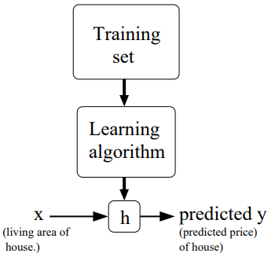
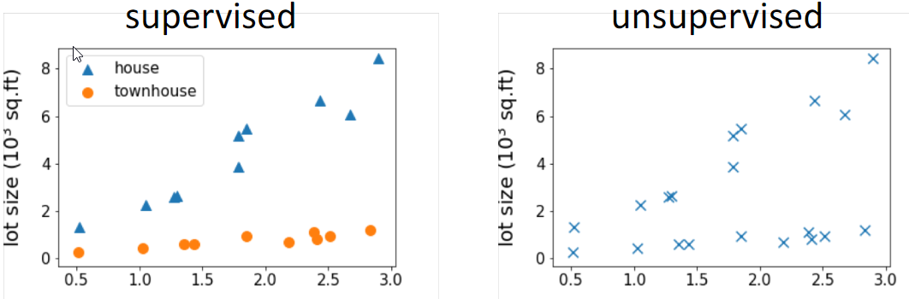
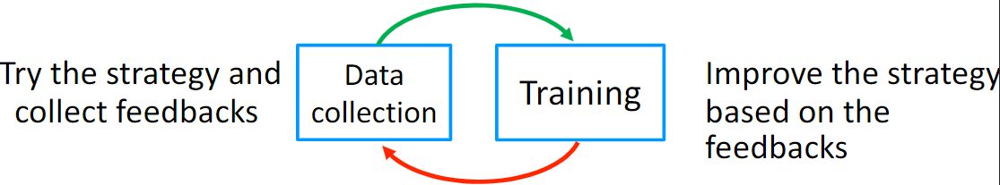
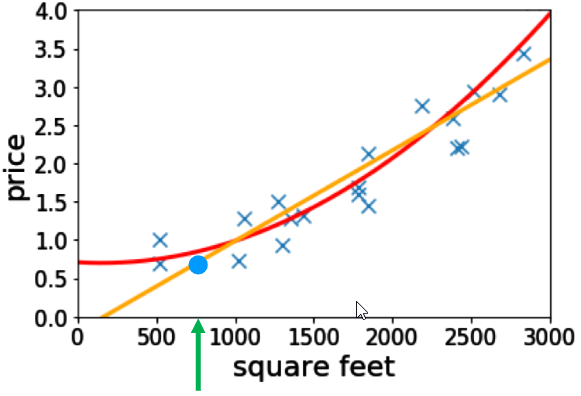
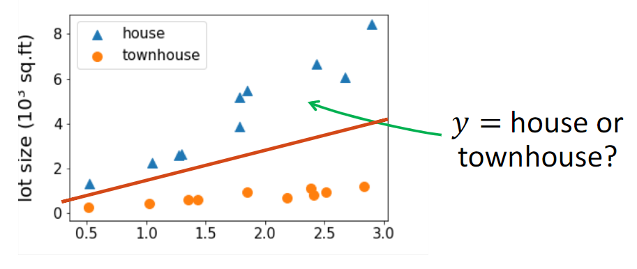

# N1. Basic_Concept

[TOC]

### 1.Machine Learning：

​	（1）**Def:**

​		**Arthur Samuel:**Machine Learning is the field of study that gives the computer the ability to learn without being explicitly programmed. 

​		**Tom Mitchell** (1998 ) : a computer program is said to learn from experience E with respect to some class of tasks T and performance measure P, if its performance at tasks in T, as measured by P, improves with experience E.

*Experience (data): games played by the program (with itself)*

*Performance measure: winning rate*

### 2.Supervised learning :

​	（1）**Def:** It had the right answers, and you wanted the algorithm to just produce more of the same. 

​	（2）**Symbol**

- ​		 $ x^{(i)} ​$   :denote the “input” variables (living area in this example), also called input features;

- ​	  	$ y^{ (i)} $ :denote the “output” or target variable that we are trying to predict (price). 

- ​		**Training example**:A pair ( $ x^{ (i)} $  ,  $  y^{ (i)} $   ) is called a training example.

- ​		 **Training set**: the dataset that we’ll be using to learn—a list of m training examples {( $ x^{(i)} $   ,  $ y^{(i)} $   );i = 1, . . . , m}—is called a training set. 

​		*Note that the superscript “(i)” in the notation is simply an index into the training set, and has nothing to do with exponentiation.* 

​		We will also use X denote the space of input values, and Y the space of output values. In this example, X = Y = ℝ

- ​		**h** : X → Y;

$$
h_θ(x) = \theta_0 + θ_1 x
$$

​		h(x) could replace $h_θ(x)​$ .h(x) is called a **hypothesis**

### 3.Unsupervised learning:

​	（1）**Def:** You're sort of not given the right answer for everything

​	（2）**Difference:**

### 4.Reinforcement learning:

​	（1）**Def:** The algorithm can collect data interactively

### 5.Regression vs Classification problem:

​	（1）regression: if y∈ℝis a continuous variable

- ​		e.g., price prediction

​	（2）classification: the label is a discrete variable

- ​		e.g., the task of predicting the types of residence

## 致谢

本页面由[Typora](http://www.typora.io/)编辑。

